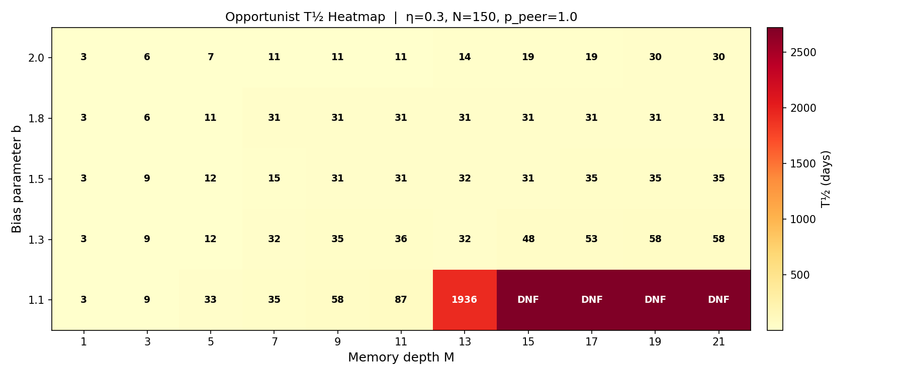

# Cognitive Memory, Peer Influence, and Behavioral Phase Transitions in Financial Markets

[](https.mit-license.org)
[](https://www.python.org/downloads/)
[](#)

An agent-based behavioral finance repository studying how **cognitive memory depth ($M$)**, **cognitive misinterpretation bias ($\eta$)**, and **word-of-mouth social sentiment transmission ($p_{\text{peer}}$)** drive phase transitions, herding, and panic crashes in financial markets. Empirical experiments are conducted on daily returns of the **Indian Nifty 50 TRI Index**.

> Adapted from the spin-memory physics framework by Li et al. (*Phys. Rev. Lett.*, 2026), reframed through behavioral finance and trader psychology.

---

## 📌 Executive Summary

Modern financial theory often assumes rational agents operating on instant information. In reality, market participants have **finite memory windows**, suffer from **cognitive misinterpretation biases** (due to emotional fear and greed), and communicate through **social peer networks**.

This repository answers four key research questions using a Monte Carlo agent-based model ($N=150$ traders) evaluated on Nifty 50 historical price data:

1. **Can market price trends alone cause herding?**  
   **No.** Without social peer influence ($p_{\text{peer}}=0$), individual cognitive errors average out via the Law of Large Numbers. Market crowds remain strictly restoring ($k>0$, single-well potential) across all memory depths ($M \in [1, 21]$) and bias levels ($\eta \in [0, 0.45]$).
2. **What triggers financial herding and panic lock-in?**  
   **Social peer transmission ($p_{\text{peer}}=1.0$).** Peer interactions induce a spontaneous pitchfork bifurcation at a **critical cognitive memory depth $M_c \approx 9.82$ trading days**, splitting crowd sentiment into a double-well potential ($k<0$) with stable bull/bear lock-in regimes.
3. **How do memory biases affect panic recovery ($T_{1/2}$)?**  
   Herding conformists experience severe **critical slowing down** ($T_{1/2} \to \infty$ for $M \ge 13$). In contrast, **recency-biased momentum traders** act as psychological circuit breakers, keeping recovery fast ($T_{1/2} \le 30$ days), while **macro-fundamental anchors** (tracking 200-day moving average shifts) eliminate permanent lock-in traps.
4. **Why is cognitive bias asymmetric around $\eta = 0.50$?**  
   Extreme cognitive misinterpretation ($\eta > 0.50$) flips the feedback direction from positive to negative, forcing traders to act as inverse sentiment indicators and suppressing bubble formation.

---

## 🧠 Behavioral Trader Archetypes

Traders maintain a First-In-First-Out (FIFO) queue $\mathbf{b}_i(t) = [b_i(t), \dots, b_i(t-M+1)]^T$ tracking past daily observations and vote using psychological weighting kernels:

$$\sigma_i(t) = \sum_{k=0}^{M-1} w_k \cdot b_i(t-k)$$

| Archetype | Weight Kernel $w_k$ | Behavioral Description |
| :--- | :--- | :--- |
| **Herding Conformist** (Pushover) | $w_k = 1/M$ | Equal weighting over past memory; relies on crowd consensus. |
| **Recency-Biased Trader** (Opportunist) | $w_k \propto b_{\text{opp}}^k \quad (b > 1.0)$ | Availability heuristic & recency bias; heavily weights recent signals. |
| **Anchored History Trader** (Traditionalist) | $w_k \propto b_{\text{trad}}^k \quad (b < 1.0)$ | Conservatism bias; heavily weights older historical memories. |
| **Mean-Reversion Trader** (Contrarian) | $s_i(t) = -\text{sign}(\sigma_i(t))$ | Deliberately trades against internal crowd consensus. |
| **Macro-Fundamental Anchor** (Curmudgeon) | $s_i(t) = \text{sign}(\Delta \text{MA}_{200}(t-1))$ | Ignores retail peer chatter; anchors strictly to 200-day macro trend slope. |

---

## 📊 Key Experimental Results & Figures

### 1. Market-Only ($p_{\text{peer}}=0$) vs. Peer-Interacting ($p_{\text{peer}}=1.0$) Crowds
- **Left**: Curvature $k$ vs memory depth $M$. Peer-interacting crowds cross $k=0$ between $M=9$ and $M=11$ (matching theoretical $M_c \approx 9.82$).
- **Right**: Reconstructed behavioral potential landscape $V(n_+)$. Single-well restoring potential transforms into double-well herding bistability for $M \ge 11$.

| Curvature Parameter $k$ vs $M$ | Potential Landscape $V(n_+)$ |
| :---: | :---: |
|  |  |

---

### 2. Panic Half-Life ($T_{1/2}$) Relaxation & Critical Slowing Down
Starting from unanimous bearish panic ($n_+(0)=0$), we track days required to reach neutrality ($n_+=0.50$):
- **Conformist crowds** suffer severe critical slowing down near $M_c$ ($T_{1/2} = 3 \to 9 \to 33 \to 36 \to 63 \to 1919 \to \text{DNF}$).
- **Recency bias** ($b=2.0$) caps recovery at $\le 30$ days.
- **10% Macro Anchors** eliminate permanent lock-in traps ($\text{DNF}$), pinning recovery to macro fundamental cycles ($\sim 360$--$500$ days).

| Half-Life $T_{1/2}$ vs Memory Depth $M$ | Opportunist Recency Bias Heatmap | Curmudgeon Nucleation Effect |
| :---: | :---: | :---: |
|  |  |  |

---

## 📁 Repository Structure

```
.
├── README.md                           # Comprehensive documentation & research summary
├── data/
│   └── nifty50_tri.csv                 # Historical Nifty 50 TRI daily price dataset
├── src/
│   ├── mixed_sim_both_crowds.py        # Market-only vs. Peer-interacting simulation & potential fitting
│   ├── heatmap_market_only.py          # Grid search across cognitive bias (η) and memory depth (M)
│   └── thalf_experiment.py             # Panic relaxation half-life (T_{1/2}) simulation script
├── paper/
│   └── swarm_memory_nifty50_paper.tex  # Complete LaTeX research paper (Behavioral Finance framing)
├── plots/                              # High-resolution generated charts & heatmaps
└── notebooks/
    └── behaviour.ipynb                 # Interactive Jupyter notebook with complete execution flow
```

---

## 🚀 Quickstart & Reproduction

### Environment Setup
```bash
git clone https://github.com/ANUJ61530/nifty50-behavioral-memory-swarm.git
cd nifty50-behavioral-memory-swarm
pip install numpy pandas matplotlib
```

### Running Simulations

1. **Market-Only vs Peer-Interacting Bifurcation Sweep**:
   ```bash
   python3 src/mixed_sim_both_crowds.py
   ```
2. **Cognitive Bias ($\eta$) $\times$ Memory Depth ($M$) Market-Only Heatmap**:
   ```bash
   python3 src/heatmap_market_only.py
   ```
3. **Panic Half-Life Relaxation ($T_{1/2}$) Experiment**:
   ```bash
   python3 src/thalf_experiment.py
   ```

---

## 📄 Research Paper

The full research paper is available in LaTeX format at [`paper/swarm_memory_nifty50_paper.tex`](paper/swarm_memory_nifty50_paper.tex). It includes complete mathematical derivations, behavioral potential physics, empirical data tables, and policy implications for market regulators.

---

## 📜 Citation & References

```bibtex
@article{kothari2026cognitive,
  title={Cognitive Memory, Peer Influence, and Behavioral Phase Transitions in Financial Markets: An Empirical Study on the Nifty 50 Index},
  author={Kothari, Anuj},
  journal={Working Paper, Behavioral Finance Research Group},
  year={2026}
}

@article{li2026informational,
  title={Informational Memory Shapes Collective Behavior in Intelligent Swarms},
  author={Li, X. and Zhang, Y. and Rubenstein, M.},
  journal={Physical Review Letters},
  volume={136},
  pages={138302},
  year={2026}
}
```
