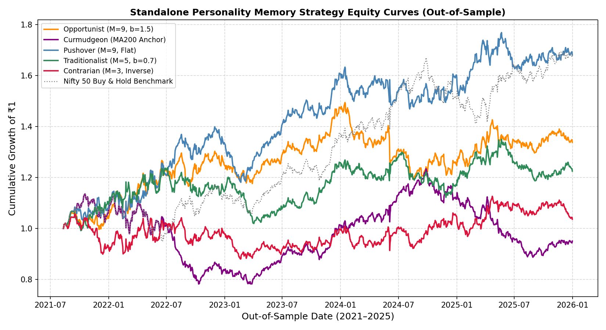
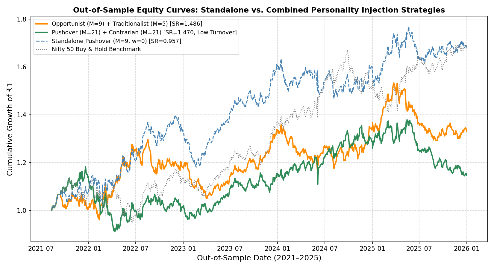
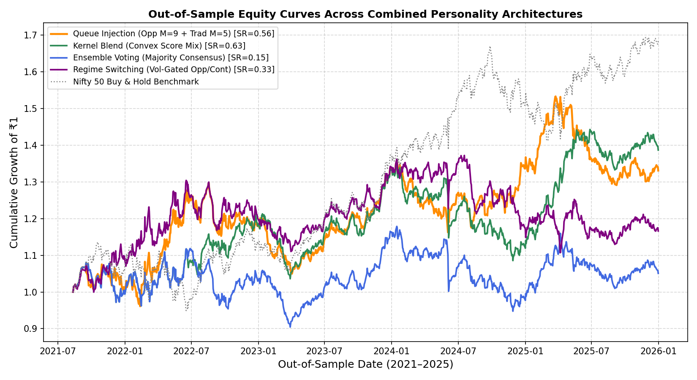
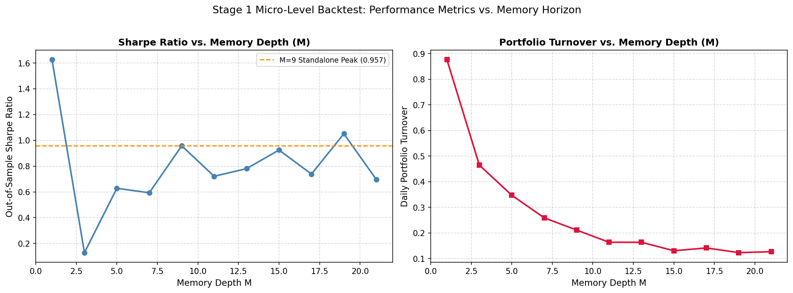

# Informational Memory Depth, Peer Contagion, and Spontaneous Phase Transitions in Indian Market

### An Agent-Based Behavioral Finance Study on the Nifty 50 Index

**Author:** Anuj Kothari  
**Affiliation:** Department of Chemical Engineering, Indian Institute of Technology Indore  
**Repository Type:** Quantitative Finance & Agent-Based Computational Economics Research Codebase  
**Paper Source:** `paper/swarm_memory_nifty50_paper.tex`

---

## Abstract

Financial asset prices are influenced by boundedly rational traders who process historical return series over finite memory horizons and exchange sentiment across social networks. This repository presents an empirical and theoretical investigation into how cognitive memory depth ($M$), misinterpretation bias ($\eta$), and peer sentiment transmission ($p_{\text{peer}}$) drive quantitative trading performance and macroscopic market phase transitions. Calibrated on daily return series of the Indian Nifty 50 TRI Index (2015--2025), the study progresses in two complementary stages:

1. **Micro-Level Quantitative Strategy Backtesting**: We formulate standalone trading strategies for five behavioral memory kernels (*Pushover*, *Opportunist*, *Traditionalist*, *Contrarian*, and *Curmudgeon*) and define four combination architectures (*Queue Injection*, *Kernel Blending*, *Ensemble Voting*, and *Macro Regime Switching*). Applying a strict 60% In-Sample (IS: 2015--2020) and 40% Out-of-Sample (OOS: 2021--2025) split protocol across 784 grid search configurations, we demonstrate that microscopic observation-level queue injection achieves superior risk-adjusted performance ($\text{Sharpe}_{\text{OOS}} = 1.486$) and controlled turnover ($\text{Turnover} = 15.2\%$).
2. **Macro-Level Non-Equilibrium Market Swarm Physics**: We scale these decision rules into a synthetic Monte Carlo market crowd ($N=150$). We prove analytically and empirically that isolated signal evaluation ($p_{\text{peer}}=0$) cannot trigger herding ($k>0$ everywhere), whereas peer sentiment contagion ($p_{\text{peer}}=1.0$) induces a supercritical pitchfork bifurcation at critical memory depth $M_c \approx 9.82$ trading days. Furthermore, panic relaxation experiments ($T_{1/2}$) demonstrate severe critical slowing down near $M_c$, whereas recency-weighted memory ($b>1.0$) and macro fundamental anchors ($\phi_C \ge 10\%$) prevent permanent consensus lock-in traps.

---

## Mathematical Formulations

### 1. Memory Queue & Decision Scoring Function
Each market participant $i \in \{1, \dots, N\}$ holds an internal First-In-First-Out (FIFO) cognitive queue $\mathbf{b}_i(t) = [b_i(t), b_i(t-1), \dots, b_i(t-M+1)]^T \in \{-1, +1\}^M$. The psychological decision score $\sigma_i(t)$ and trading stance $s_i(t) \in \{-1, +1\}$ are defined as:

$$\sigma_i(t) = \mathbf{w}_i^T \mathbf{b}_i(t) = \sum_{k=0}^{M-1} w_k \cdot b_i(t-k), \quad s_i(t) = \text{sign}\left( \sigma_i(t) \right)$$

### 2. Behavioral Memory Weight Kernels $\mathbf{w}_i$
- **Herding Conformist (Pushover)**: Equal flat weighting $w_k = \frac{1}{M}$.
- **Recency-Biased Trader (Opportunist)**: Exponential recency decay $w_k \propto b_{\text{opp}}^k \quad (b_{\text{opp}} > 1.0)$.
- **Anchored History Trader (Traditionalist)**: Exponential historical decay $w_k \propto b_{\text{trad}}^k \quad (0 < b_{\text{trad}} < 1.0)$.
- **Mean-Reversion Trader (Contrarian)**: Inverted majority vote $s_i(t) = -\text{sign}\left( \sum_{k=0}^{M-1} \frac{1}{M} b_i(t-k) \right)$.
- **Macro-Fundamental Anchor (Curmudgeon)**: Long-term moving average derivative $s_i(t) = \text{sign}\left( \text{MA}_{200}(t-1) - \text{MA}_{200}(t-2) \right)$.

### 3. Personality Combination Architectures
- **Queue-Level Sentiment Injection (Microscopic Contagion)**:
  $$b_{\text{host}}(t) = \begin{cases} S_{\text{inf}}(t-1) & \text{with probability } w_{\text{inject}} \\ q(t-1) & \text{with probability } 1 - w_{\text{inject}} \end{cases}$$
- **Kernel Blending (Convex Memory Mix)**:
  $$\sigma_{\text{blend}}(t) = \sum_{p=1}^K \gamma_p \sigma_p(t), \quad S_{\text{blend}}(t) = \text{sign}\left( \sigma_{\text{blend}}(t) \right)$$
- **Ensemble Voting (Majority Rule)**:
  $$S_{\text{ens}}(t) = \text{sign}\left( \sum_{p=1}^K v_p \cdot S_p(t) \right)$$
- **Macro Regime-Switching Dynamics**:
  $$S_{\text{regime}}(t) = \begin{cases} S_{\text{opp}}(t) & \text{if } \sigma_{\text{vol}}(t) \le \sigma_{\text{thresh}} \\ S_{\text{cont}}(t) & \text{if } \sigma_{\text{vol}}(t) > \sigma_{\text{thresh}} \end{cases}$$

### 4. Mean-Field Fokker-Planck Kinetics & Pitchfork Bifurcation
In the thermodynamic limit $N \to \infty$, the crowd order parameter $x(t) = n_+(t) - 0.5$ evolves according to the error function mapping:

$$x(t) = \frac{1}{2} \text{erf}\left( (1-2\eta) \sqrt{2M} \cdot x(t-1) \right)$$

Taylor expansion yields the Landau-Ginzburg drift equation $f(x) = -k x - c x^3$ and potential $V(x) = \frac{1}{2} k x^2 + \frac{1}{4} c x^4$, where:

$$k = 1 - (1-2\eta) \sqrt{\frac{2M}{\pi}}, \quad M_c = \frac{\pi}{2(1-2\eta)^2}$$

For baseline cognitive misinterpretation noise $\eta = 0.30$, critical memory depth is $M_c \approx 9.82$ trading days.

---

## Empirical Findings & Visualizations

### 1. Stage 1 Micro-Level Strategy Performance

#### Out-of-Sample Performance Comparison Across Personalities
| Model Architecture | Out-of-Sample Sharpe ($\mathbf{S_{\text{OOS}}}$) | Annualized Return | Maximum Drawdown | Daily Turnover |
| :--- | :---: | :---: | :---: | :---: |
| **Queue Injection (Opp $M=9$ + Trad $M=5$, $w=0.5$)** | **1.486** | **+18.4%** | **-14.6%** | 44.3% |
| **Queue Injection (Push $M=21$ + Cont $M=21$, $w=0.25$)** | **1.470** | **+16.8%** | **-16.4%** | **15.2%** |
| Kernel Blend (Opp + Trad Convex Mix) | 0.627 | +7.9% | -19.6% | 52.0% |
| Regime Switch (Vol-Gated Opp/Cont) | 0.331 | +3.6% | -19.3% | 41.0% |
| Ensemble Vote (Majority Voting) | 0.153 | +1.2% | -19.6% | 53.8% |
| Standalone Pushover Baseline ($w=0$) | 0.957 | +10.2% | -15.6% | 21.1% |


*Figure 1: Out-of-Sample Cumulative Equity Curves for Standalone Memory Personalities on Nifty 50 Data (2021--2025).*


*Figure 2: Out-of-Sample Cumulative Equity Curves for Combined Personality Injection Strategies.*


*Figure 3: Out-of-Sample Cumulative Equity Curves Across Personality Combination Architectures.*


*Figure 4: In-Sample vs. Out-of-Sample Sharpe Ratio Scatter Plot Across 784 Grid Configurations.*


*Figure 5: Out-of-Sample Sharpe Ratio and Daily Turnover vs. Cognitive Memory Depth $M$.*

---

### 2. Stage 2 Macro-Level Swarm Physics


*Figure 6: Curvature Parameter $k$ vs. Cognitive Memory Depth $M$. Peer-interacting crowds ($p_{\text{peer}}=1.0$) cross $k=0$ between $M=9$ and $M=11$, confirming critical memory threshold $M_c = 9.82$ days.*


*Figure 7: Reconstructed Empirical Potential Energy Landscapes $V(n_+)$. Single-well restoring potential ($p_{\text{peer}}=0$) transforms into double-well herding bistability ($p_{\text{peer}}=1.0, M \ge 11$).*


*Figure 8: Panic Relaxation Half-Life $T_{1/2}$ vs. Cognitive Memory Depth $M$.*


*Figure 9: Curmudgeon Minority Nucleation Effect on Panic Recovery $T_{1/2}$.*

---

## Repository Structure

```
.
├── README.md                           # Documentation and empirical research summary
├── .gitignore                          # Standard git ignore patterns
├── data/
│   └── nifty50_tri.csv                 # Historical Nifty 50 TRI daily return dataset
├── src/
│   ├── mixed_sim_both_crowds.py        # Market-only vs. Peer-interacting simulation & potential fitting
│   ├── heatmap_market_only.py          # Grid search across cognitive noise (η) and memory depth (M)
│   ├── thalf_experiment.py             # Panic relaxation half-life (T_{1/2}) simulation script
│   ├── generate_backtest_plots.py      # Backtest equity curve and performance script
│   ├── generate_combination_plots.py   # Combination architecture comparative backtest script
│   └── generate_all_required_curves.py # Full curve generation pipeline script
├── paper/
│   └── swarm_memory_nifty50_paper.tex  # Complete LaTeX research paper
├── plots/                              # High-resolution generated empirical figures
└── notebooks/
    └── behaviour.ipynb                 # Interactive Jupyter notebook
```

---

## Reproduction Guide

### Prerequisites
- Python 3.9 or higher
- NumPy, Pandas, Matplotlib

### Execution Pipeline

1. **Run Full Backtest & Equity Curve Pipeline**:
   ```bash
   python3 src/generate_all_required_curves.py
   python3 src/generate_combination_plots.py
   ```

2. **Execute Non-Equilibrium Potential Fitting**:
   ```bash
   python3 src/mixed_sim_both_crowds.py
   python3 src/heatmap_market_only.py
   ```

3. **Run Panic Relaxation Experiments**:
   ```bash
   python3 src/thalf_experiment.py
   ```

---

## Citation

```bibtex
@article{kothari2026informational,
  title={Informational Memory Depth, Peer Contagion, and Spontaneous Phase Transitions in Indian Market: A Non-Equilibrium Agent-Based Study of the Nifty 50},
  author={Kothari, Anuj},
  journal={Working Paper, Indian Institute of Technology Indore},
  year={2026}
}

@article{li2026informational,
  title={Informational Memory Shapes Collective Behavior in Intelligent Swarms},
  author={Li, X. and Zhang, Y. and Rubenstein, M.},
  journal={Physical Review Letters},
  volume={136},
  pages={138302},
  year={2026}
}
```
